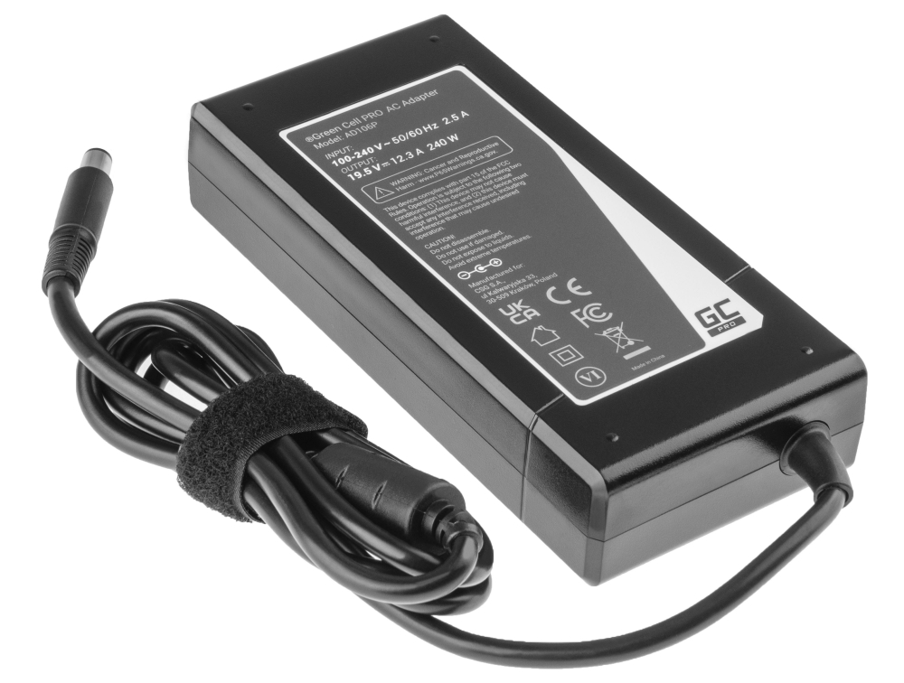

# Wiring / Flashing Controller

Controller wiring and flashing is best left to the main docs, as it explains everything in great detail and needs no further comment.





**REMEMBER TO NEVER TRUST WIRE COLOR CODING!** Always match connections by pinout and names, never trust wire colors from images or videos as they can be different depending on what you have.

***

## ODrive DFU Application

Developed by EulerOliveira from the FFBeast community server, the ODrive DFU application helps in setting the controller board into DFU mode for flashing, something a lot of people face trouble with. Feel free to check it out incase you're facing similar issues!



***

## ODrive Backflow Protection (Relay Wiring)

Another helpful piece of information shared by EulerOliveira. As the ODrive controller is susceptible to damage due to power backflow from spinning the wheel (and hence the motor) excessively while the whole thing is powered down, cheap relays can be wired up between the motor and the controller to cut off the connection when there is no power.



<figure><figcaption></figcaption></figure>



<figure><figcaption></figcaption></figure>



Remember to use relays which are driven using 5V, and to wire up the motor to the NO (normally open) terminals so that the circuit is broken when the board is unpowered!
