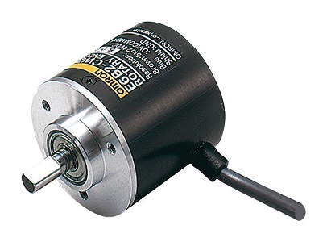
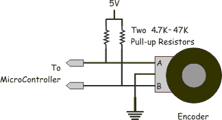

# Encoder

## Supported Encoder Types

As of now, the FFBeast firmware exclusively supports **incremental type** encoders. Any incremental type encoder should theoretically be compatible, whether it be optical, magnetic or another type, as long as it outputs A/B pulses. The Z index is not utilised, so it is not critical whether the encoder has it or not.

***

## What are PPR & CPR?

**PPR** **- Pulses Per Rotation:** Indicates the number of pulses generated by each channel (A or B) for one full rotation of the encoder.

**CPR** **- Counts Per Rotation:** Indicates the number of position counts that can be calculated from the encoder by combining the pulses from both channels (A & B). This is also what is used when setting up the wheel.

```
CPR = 4 x PPR
```

## CPR Requirement

While any encoder should work, for optimal performance when using the firmware with the hoverboard motor, it is recommended by the developer to use an encoder with 1000 CPR or higher when directly connected to the motor shaft without reduction. If the encoder is connected with a reducer, one with lower resolution can be used.

***

## Recommended Encoders

The following encoders have been tested and are guaranteed to work, according to the main docs. No direct links for purchase are provided as they tend to expire, so just use a search engine to find the most up-to-date options.

### CUI - AMT 10x Series



<figure><figcaption></figcaption></figure>



The most expensive yet highly reliable option available. Comes in a very compact form, and is represented by several options:

* AMT-102 (8192 CPR)
* AMT-103 (8192 CPR)
* **AMT-10E2 (20480 CPR)**
* **AMT-10E3 (20480 CPR)**

The last two options (in bold) are preferred as they cost the same as the first two yet have a higher CPR value.



### OMRON Style



<figure><figcaption></figcaption></figure>



Countless variants available. All of them are “clones” of the OMRON encoder. Different CPR available. Examples of models are:

* E6B2-CWZ5B
* E6C2-CWZ6C
* 38S6G5-B-G24N
* E6B2-CWZ1X
* YT06
* Etc…




**Verify the power requirements and needs of pull-down or pull-up for the encoder!**

Not all encoders operate on a 5V supply; some may require 12V or even 24V. Additionally, check the datasheet for the specific mode of your encoder and whether it requires pulling the signal lines to ground or the power line.

If the output in the encoder datasheet is marked as **NPN** - it **REQUIRES PULL UP resistors on signal lines!** Otherwise it will not work properly.




### Magnetic Encoders



<figure><figcaption></figcaption></figure>



The most economical solution, involving a PCB with a small chip which must have a magnet precisely positioned for optimum rotation measurement. This would typically require custom mounting solutions, proper mounts have been created by members of the FFBeast community. Some recommended magnetic encoders are:

* MT6701 (4096 CPR)
* MT6825 (16384 CPR)
* Etc...



***

## Which Encoder Should I Use?

It depends on your budget, tools on hand, CPR requirement, ease of mounting, and much more! Generally the magnetic encoder with an appropriate mounting solution is recommended due to it being budget friendly and quite reliable. OMRON style encoders are better suited for encoders mounted via gears or belts. More information regarding mounting solutions can be found here!

***

## Can I Use The Motor's Built-In HAL Sensors?

Nope! The hall effect sensors inside the hoverboard motors are not precise enough for the algorithm to work.
