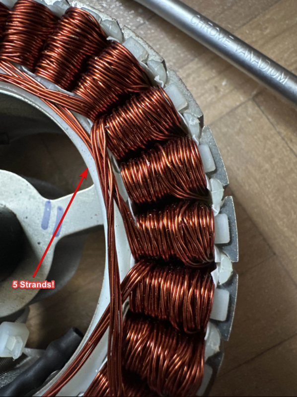

# Motor


**Read the** [**official docs**](https://ffbeast.github.io/docs/en/hardware_motor.html) **for more info on other types of motors!**\
This section only focuses on hoverboard motors which are most commonly used in FFBeast builds.


You aren't required to use hoverboard motors for your build, however they are considered the **best** right now due to their **excellent price-to-torque ratio,** so this document will be focusing on them. These cheap motors can be found used for as little as $10 and can provide up to 15Nm of torque. They can be bought stand-alone or as part of the entire hoverboard (which would give you two of them!).

## Hoverboard Motor Sizes

For the purposes of this guide, we're going to focus on the commonly available 6.5 inch (diameter including wheel) motor size. While larger sizes exist, they tend to have the same internals inside, giving no useful output. What really matters is what's inside.

Unfortunately, these motors can vary internally, giving different performance characteristics. The **motor's power** is determined by the width of the stator, the magnet length and the number of strands in the motor windings.

<table><thead><tr><th data-type="number">Stator Width (mm)</th><th data-type="number">Magnet Length (mm)</th><th data-type="number">No. Of Strands</th><th data-type="number">Torque (Nm)</th></tr></thead><tbody><tr><td>20</td><td>20</td><td>3</td><td>10.9</td></tr><tr><td>25</td><td>25</td><td>4</td><td>12.7</td></tr><tr><td>30</td><td>30</td><td>5</td><td>15</td></tr></tbody></table>


The values above reflect real world tests at 15A current. While all these motors will work, the peak torque is affected by the internals. Therefore it's in your best interest to try and get a 30mm motor for the best performance!



{% column width="50%" %}
<figure><figcaption>
5 Strand Motor Winding
</figcaption></figure>


{% column width="50%" %}
<figure><figcaption>
30mm Stator Width
</figcaption></figure>




{% column width="41.66666666666667%" %}
<figure><figcaption>
30mm Magnet Length
</figcaption></figure>


{% column width="58.33333333333333%" %}
<figure><figcaption>
30mm Magnet / Stator Size
</figcaption></figure>



***

## How To Get The Best Motor

From the data provided above, while all these motors will work for your build, the best one to get is a 30mm, 5 strand one. Unfortunately, there is no absolute & reliable way to determine the internal components of a motor without disassembling it. Two motors could look the exact same from the size and front pattern from the outside but have completely different internal component sizes.

Our solution is to weigh the motor and use serial numbers to guess what the motor internals will be! Since more powerful motors have more metal inside, they will also weigh more.

| Motor  Type                 | Weight (kg)          |
| --------------------------- | -------------------- |
| 30mm Magnet / Stator Length | \~2.9 kg (with tyre) |
| 25mm Magnet / Stator Length | \~2.6 kg (with tyre) |
| 20mm Magnet / Stator Length | \~2.3 kg (with tyre) |

<figure><figcaption>
30mm Magnet / Stator Length Motor
</figcaption></figure>

***

Another method you can use to find & purchase 30mm motors is to use serial numbers. The following list of serial numbers has been submitted by members in our community and are confirmed to belong to 30mm internal motors. If the motor you find has a similar serial number, there is a **chance** you might have the best motor!


WARNING: The following method is not as reliable as the weight guessing method for finding a 30mm motor, mostly due to the lack of data. Users who have had success using this had serial numbers starting with "SYZZB30", with the "30" most likely indicating magnet / stator size. We have not yet figured out how the other serial numbers are formatted. If you only use this method, you accept the risk of ending up with a less powerful motor!


| SYZZB30-36V150949975 | HHJ30NT36V160...     | HZLDJ36V17110997344 |
| -------------------- | -------------------- | ------------------- |
| YM36V30HC160100109   | WT30H36V20180811     | ATA36V1608250526    |
| SYZZB30-36V151103426 | FS30NT36V15092635031 | JB36V151150629      |
| SYZZB30-36V151059046 | 36VHL17H08221738     | ATA36V1608250632    |
| SYZZB30-36V151283552 | HC36V1610119288      |                     |

***

## Will Plastic Housing Motors Work?

While hoverboard motors with a plastic housing would work, they are generally not recommended as they are not as mechanically strong and don't conduct heat away as effectively as metal from the motor during use, which could potentially damage it. If you have the option, don't use them.
