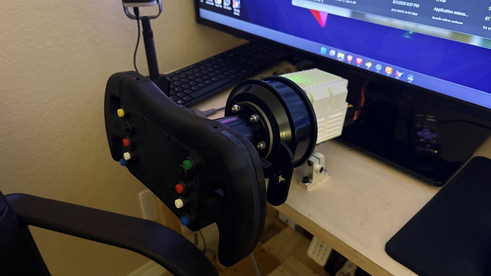

# Power Supply

## PSU Voltage

When choosing your PSU voltage, you're mainly restricted by your motor's operating voltage and the maximum voltage of your controller, starting from 12V. For FFBeast wheel builds made with hoverboard motors, a 24V PSU is recommended as it's not worth the price increase to go up to 36V for a marginal max RPM increase (unless you want your wheel to spin like a fan?).

## PSU Power

The PSU power depends on how you intend to use your wheel. Too low, and you'll have to decrease your power output to prevent the power supply from tripping & shutting down. Too high, and you'll be wasting money on headroom your motor will never use. For maximum performance and power, a 20 amp power supply is recommended as hoverboard motors tend to use \~15A max at 24V, giving you 5A of headroom.

***

## Power Supply Types

The most common PSU types used with FFBeast wheels include enclosed "power bricks" and open terminal style / modular style.

### Enclosed "Power Brick" PSUs



<figure><figcaption></figcaption></figure>



Pros:

* Easy to use & integrate.
* No open terminals.
* No wiring involved, connector included.
* Silent

Cons:

* Possibly expensive.
* Only enough for reduced power % as they're limited in power output.



### Modular or Open Terminal PSUs



<figure><figcaption></figcaption></figure>



Pros:

* Available in many amperage ratings.
* Easy to find, loads of cheap copies available.

Cons:

* Open terminals.
* Correct wiring required.
* Many of them have noisy cooling fans.




### PSU Pairing

Alternatively, you can also pair two **IDENTICAL** (in both voltage and power) power supplies together by wiring them in parallel, effectively doubling the max power output while keeping the voltage the same. This allows you to, for example, use two identical but low power "power brick" style power supplies to achieve the same result as a high power power supply while mitigating the issues of open terminals, wiring, noise, etc.



<figure><figcaption></figcaption></figure>



Pros (when using enclosed PSUs):

* No noise.
* Fully enclosed PSUs, no open terminals.
* No power limit restriction.

Cons:

* Identical power supplies required.
* Custom wiring involved to connect them in parallel.


